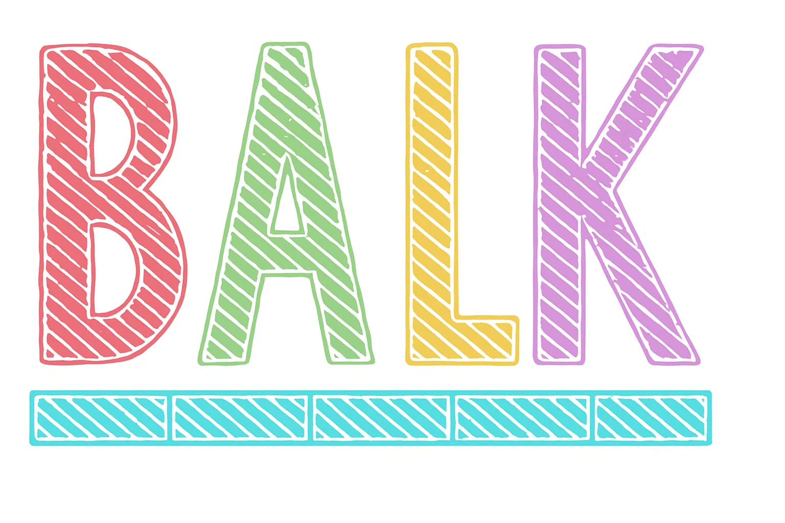

<div align="center">
  
  
  # balk
  
  > Terminal string styling for Bun, chalk-compatible API using native `Bun.color()`
  
  [](https://bun.sh)
</div>

## Features

- 🚀 **Bun-native** - Leverages `Bun.color()` for optimal performance
- 🎯 **Chalk-compatible** - Drop-in replacement for chalk with identical API
- 🔗 **Fully chainable** - Combine styles with ease
- 📦 **Multiple formats** - ESM, CommonJS, and direct Bun imports
- 🎨 **Rich color support** - 16 colors, 256 colors, TrueColor (16m colors)
- 🛡️ **TypeScript** - Full type definitions included
- 🪶 **Lightweight** - Zero dependencies, optimized for Bun

## Installation

```bash
bun add balk
```

## Usage

```typescript
import balk from 'balk';

// Basic colors
console.log(balk.red('Error: Something went wrong!'));
console.log(balk.green('Success: Operation completed'));
console.log(balk.blue('Info: Processing...'));

// Chaining styles
console.log(balk.red.bold.underline('Critical Error'));
console.log(balk.bgBlue.white.bold(' NOTIFICATION '));

// RGB and Hex colors
console.log(balk.rgb(255, 136, 0)('Custom RGB orange'));
console.log(balk.hex('#FF8800')('Custom hex orange'));
console.log(balk.bgRgb(128, 0, 128).white('Purple background'));

// 256 colors
console.log(balk.ansi256(214)('256 color orange'));
console.log(balk.bgAnsi256(93)('Purple background'));
```

## API

### Modifiers

- `balk.bold` - Make text bold
- `balk.dim` - Make text dim
- `balk.italic` - Make text italic
- `balk.underline` - Underline text
- `balk.inverse` - Inverse background and foreground colors
- `balk.hidden` - Hide text
- `balk.strikethrough` - Strike through text
- `balk.visible` - Make text visible (no-op, for compatibility)

### Colors

- `balk.black`
- `balk.red`
- `balk.green`
- `balk.yellow`
- `balk.blue`
- `balk.magenta`
- `balk.cyan`
- `balk.white`
- `balk.gray` (or `balk.grey`)

### Bright Colors

- `balk.blackBright`
- `balk.redBright`
- `balk.greenBright`
- `balk.yellowBright`
- `balk.blueBright`
- `balk.magentaBright`
- `balk.cyanBright`
- `balk.whiteBright`

### Background Colors

All foreground colors have a background variant. Simply prefix with `bg`:

- `balk.bgRed`
- `balk.bgGreen`
- `balk.bgBlue`
- etc.

### Advanced Colors

```typescript
// RGB (0-255)
balk.rgb(255, 0, 0)('Red text');
balk.bgRgb(0, 255, 0)('Green background');

// Hex colors
balk.hex('#FF0000')('Red text');
balk.bgHex('#00FF00')('Green background');

// ANSI 256 colors
balk.ansi256(196)('Red text');
balk.bgAnsi256(46)('Green background');
```

### Utilities

```typescript
import { stripColor, supportsColor } from 'balk';

// Remove ANSI codes from string
const plain = stripColor(balk.red('colored text'));
console.log(plain); // 'colored text'

// Check if terminal supports color
if (supportsColor) {
  console.log(balk.green('Color supported!'));
}
```

## Environment Variables

- `FORCE_COLOR` - Set to `0` to disable colors, any other value to force colors
- Color detection respects TTY status and CI environment variables

## Comparison with Chalk

balk provides a fully compatible API with chalk, optimized for Bun:

```typescript
// This chalk code:
import chalk from 'chalk';
console.log(chalk.blue.bold('Hello'));

// Works identically with balk:
import balk from 'balk';
console.log(balk.blue.bold('Hello'));
```

## Performance

balk leverages Bun's native `Bun.color()` API for color conversion, providing optimal performance in the Bun runtime while maintaining full chalk compatibility.

## Development

```bash
# Install dependencies
bun install

# Run tests
bun test

# Build
bun run build
```

## License

MIT

## Credits

API design inspired by [chalk](https://github.com/chalk/chalk), optimized for [Bun](https://bun.sh) runtime.